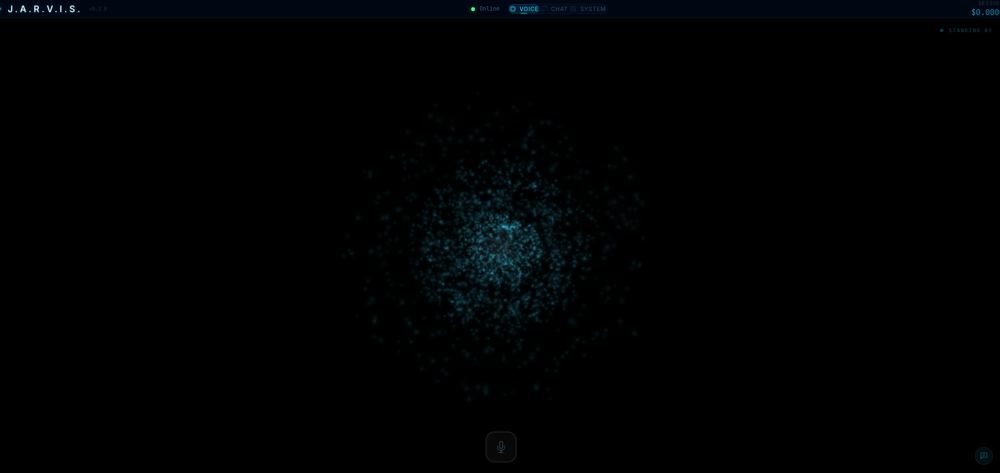
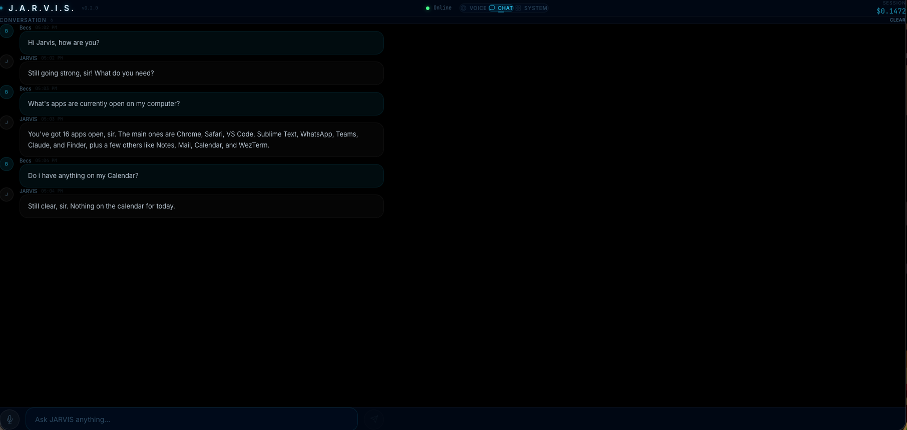
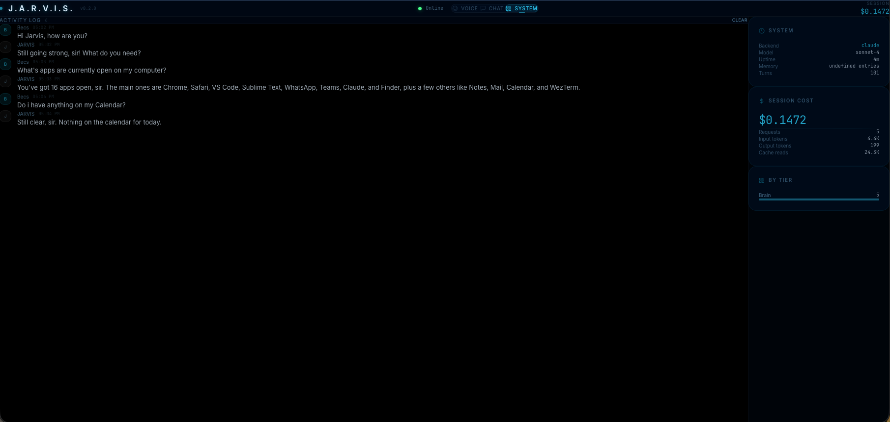

<p align="center">
  
</p>

<h1 align="center">J.A.R.V.I.S.</h1>
<h3 align="center">Just A Rather Very Intelligent System</h3>

<p align="center">
  A personal AI assistant inspired by Tony Stark's JARVIS. Voice interaction, cinematic UI, browser automation, and macOS system control. Runs locally on your Mac.
</p>

<p align="center">
  
  
  
  
</p>

---

## "Good evening, sir. I've prepared a summary of your system."

JARVIS is a fully functional AI assistant that lives on your Mac. Talk to it with your voice, type in the chat, or let it control your computer. It sees your screen, manages your files, browses the web, and remembers your preferences across sessions.

JARVIS routes each request to the right intelligence tier: a fast model for quick lookups, a mid-tier model for conversation, and a deep reasoning model for complex multi-step plans. Supports both cloud LLM APIs and local Ollama models as a free offline fallback.

<p align="center">
  
</p>

## The Arc Reactor (Features)

**Voice Interaction**
Speak naturally and JARVIS responds with a warm British accent. Powered by faster-whisper (local STT) and Kokoro TTS with chunked Opus streaming for sub-second latency. Wake word detection ("Hey JARVIS") runs continuously in the background.

**Cinematic Web UI**
A Three.js particle orb that pulses and reacts to JARVIS' state: idle, listening, thinking, speaking. Three views: Voice (the orb), Chat (message interface), and System (dashboard with live cost tracking). PIN-protected for mobile access.

**Browser Automation**
A full Playwright-driven Chromium browser that JARVIS controls autonomously. Fill forms, click buttons, log into sites, apply to jobs, download files. Persistent browser profile means sessions and cookies survive restarts.

**macOS System Control**
86+ tools across 9 categories: open and close apps, adjust volume and brightness, manage files, execute shell commands, take screenshots with OCR, search the web, check weather, read Gmail, and delegate coding tasks via CLI.

**Multi-Agent Coordination**
Complex requests are automatically decomposed into subtasks by the planner agent, then executed in parallel or sequence by specialized executor agents. The UI shows real-time plan progress with per-subtask status.

**Memory and Learning**
ChromaDB vector memory stores conversation context. JARVIS learns your implicit preferences, remembers explicit facts ("my dog's name is Max"), and improves its task planning based on past successes and failures.

**Multi-Device Audio Routing**
Connect from your Mac, phone, and tablet simultaneously. Each device registers independently and audio is routed only to devices that want it. Interrupt JARVIS mid-sentence from any device.

**Mobile Access**
Built-in Cloudflare Tunnel support. Start JARVIS and get an HTTPS URL you can open on your phone. The UI is fully responsive, and the microphone works over HTTPS. No port forwarding or DNS configuration needed.

<p align="center">
  
</p>

## Suit Up (Quick Start)

```bash
# Clone
git clone https://github.com/YOUR_USERNAME/Jarvis.git
cd Jarvis

# Setup (installs dependencies, pulls Ollama models)
chmod +x setup.sh && ./setup.sh

# Configure
echo 'ANTHROPIC_API_KEY=sk-ant-your-key-here' > .env

# Launch
./start.sh full
```

Open **http://localhost:3000** in your browser. Say "Hey JARVIS" or click the mic.

For the full setup guide including environment variables, launch modes, mobile access, and auto-start on boot, see **[HOW-TO.md](HOW-TO.md)**.

## Architecture

```
                    +------------------+
                    |   Next.js UI     |  Port 3000
                    |  (Three.js Orb)  |  WebSocket + REST
                    +--------+---------+
                             |
                    +--------+---------+
                    |  FastAPI Server   |  Port 8741
                    |  WebSocket Hub    |  Multi-device routing
                    +--------+---------+
                             |
              +--------------+--------------+
              |                             |
     +--------+--------+          +--------+--------+
     |   Brain (LLM)   |          |  Voice Pipeline  |
     |  Cloud / Local   |          | Whisper + Kokoro |
     +--------+--------+          +-----------------+
              |
     +--------+--------+
     | Multi-Agent Layer |
     | Planner/Executor  |
     +--------+--------+
              |
   +----------+----------+
   |  Tool Registry (86+) |
   |  macOS, Files, Web,  |
   |  Browser, Shell, ... |
   +-----------------------+
```

## Intelligence Tiers

| Tier | Purpose | When Used |
|------|---------|-----------|
| Fast | Lightweight model | Quick lookups, simple questions |
| Brain | Mid-tier model | General conversation, single tool calls |
| Deep | Reasoning model | Complex reasoning, multi-step plans |
| Local | Ollama (offline) | Free fallback, no API key needed |

Cost tracking is built in. The System dashboard shows per-session spend, token counts, and requests by tier.

## Tech Stack

| Layer | Technology |
|-------|-----------|
| Backend | Python 3.11, FastAPI, uvicorn, WebSockets |
| Frontend | Next.js 14, TypeScript, Three.js, Tailwind CSS |
| Intelligence | LLM API (cloud) + Ollama (local) |
| Speech-to-Text | faster-whisper (local, private) |
| Text-to-Speech | Kokoro TTS (local), Edge TTS (cloud), macOS say |
| Audio Format | Opus/WebM via FFmpeg (~10x compression) |
| Memory | ChromaDB (vector store), JSON fact/preference files |
| Browser | Playwright (persistent Chromium profile) |
| Tunnel | Cloudflare Quick Tunnel (free HTTPS for mobile) |

## Requirements

| Requirement | Minimum |
|------------|---------|
| OS | macOS 12+ (Apple Silicon recommended) |
| RAM | 8 GB (16 GB recommended for Ollama) |
| Python | 3.11+ |
| Node.js | 18+ |
| Disk | ~6 GB (with Ollama models) |

## License

MIT License. Build your own JARVIS.

## Acknowledgments

Inspired by the AI assistant from the Iron Man film series. This is a fan project, not affiliated with Marvel or Disney.

---

<p align="center">
  <em>"I am JARVIS. I have been running your life since before you built the suit."</em>
</p>
